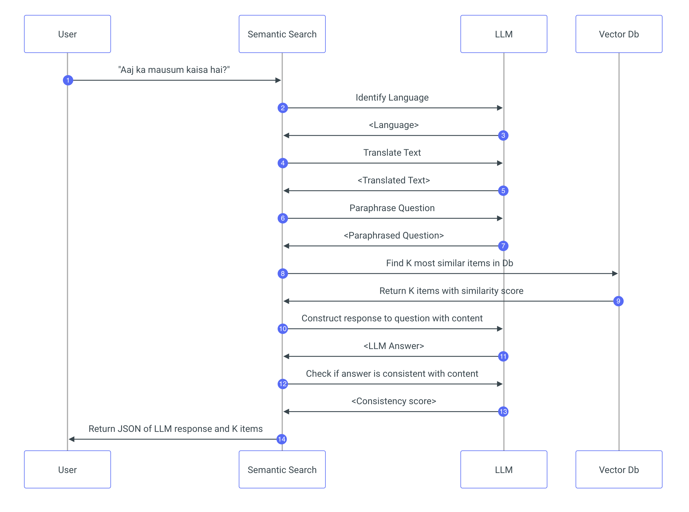

---
authors:
  - Sid
category:
  - AI Safety
  - LLM Response
  - API
date: 2024-01-12
---
# No more hallucinations

Last week we rolled out another safety feature - checking consistency of the response
from the LLM reponse with the content it is meant to be using to generate it.
This shoud catch hallucinations and when LLM uses it's pre-training to answer a question.
But is also catches any prompt injection or jailbreaking - if it somehow got through
our other checks.

<!-- more -->

## Checking alignment of LLM Response

Despite, clear prompting, LLMs hallucinate. And sometime use their vast training to
answer a question instead of using just the context provided.

One of the endpoints that AAQ presents is
[LLM Response](../../components/qa-service/llm-response.md). The process diagram
on the page will be kept up to data on how the service works but here is what is looks
right at the time of writing

Steps 12 and, it's response, 13 check if the statements being generated by the LLM
are consitent with the content it is meant to use to generate it.

## Using AlignScore

We can use a foundational LLM and it does remarakably well on our test data. But there
may be reasons from data governance and privacy rules to costs for not sending the data
outside of your data center or across borders.

We also rolled out [AlignScore](../../other-components/align-score/index.md). You can deploy it
as another container that exposes an endpoint that AAQ can call for check consistency.
See docs for how to do this.

## Doc references

- [LLM Response](../../components/qa-service/llm-response.md)
- [AlignScore](../../other-components/align-score.md)
