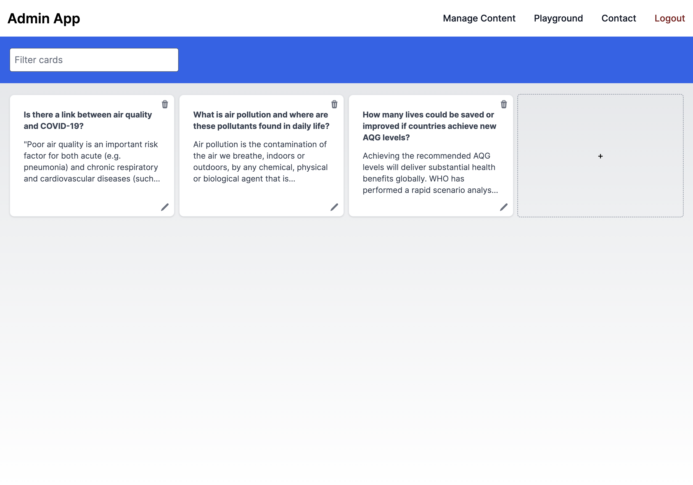
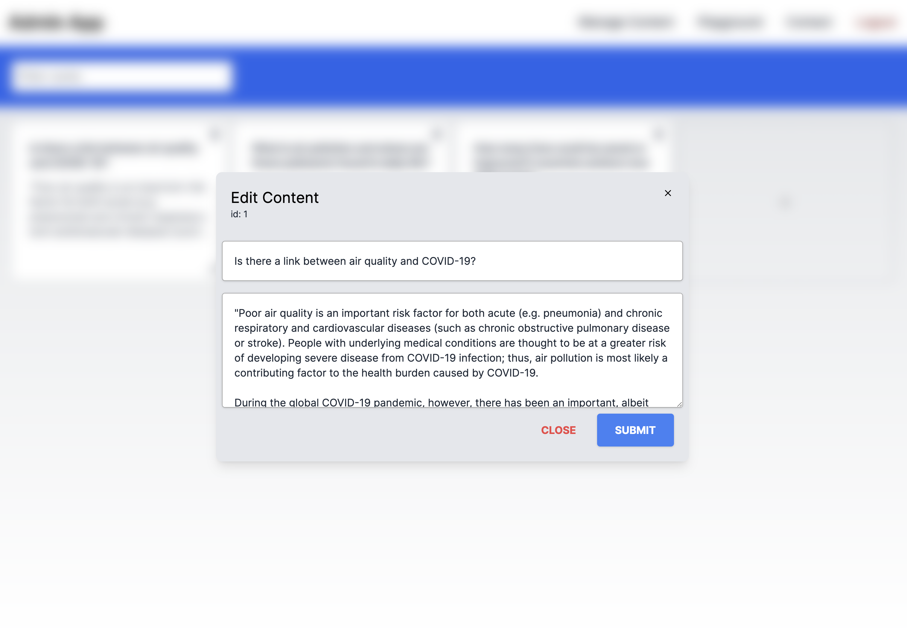

---
authors:
  - Tanmay
category:
  - Architecture

date: 2024-03-22
---

# Hello Material UI

We've switched to MaterialUI: Cleaner, easier to build and maintain, more familiar.

<!-- more -->

## Why change?

Design best practices are "best practices" for having a proven track record of creating engaging, intuitive, and effective user experiences. Google has encapsulated this in the creation of MaterialUI — a design language well-infused with the principles of good design. Embracing these principles, we're thrilled to announce a significant shift in our project's Admin App: the transition to using MaterialUI components.

This shift is a step towards cleaner maintainable code and a commitment to providing simpler and more familiar user experiences.

| Old UI                                                                | MUI                                                                |
| --------------------------------------------------------------------- | ------------------------------------------------------------------ |
| Main page                                                             |
| {: .blog-img } | {: .blog-img } |
| Edit page                                                             |
| {: .blog-img } | {: .blog-img } |

We're already starting to see some benefits of moving to Material UI:

- __Cleaner Codebase__:
  MaterialUI components are modular and customizable, and has allowed us to achieve a polished look with less custom CSS.

- __Easier to Build and Maintain__:
  MaterialUI's extensive component library has significantly reduced our development time. Components like buttons, nav bars, and switches come with a variety of options that are easily customizable.

- __Familiarity and Consistency__:
  MaterialUI is a design language familiar to millions of users worldwide, thanks to Google's widespread implementation across its products. This is helping us lower the learning curve for new users and is ensuring consistency across devices.
