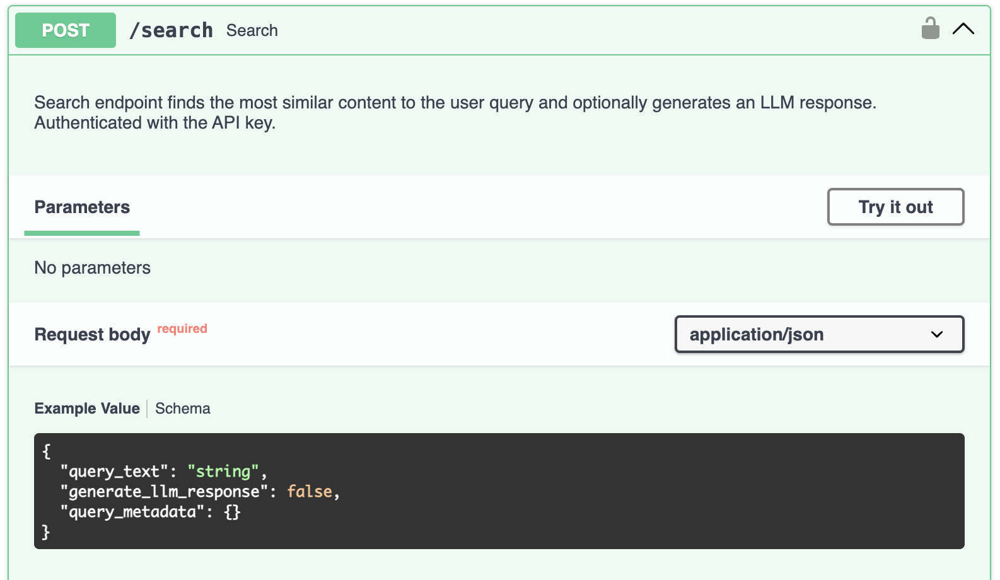

---
authors:
  - Amir
category:
  - API

date: 2024-07-18
---
# One Endpoint to Rule Them All

Refactored our two question-answering endpoints to a single one called `/search` for clarity and ease of use.

<!-- more -->

## Why change?

We realised our two `/embeddings-search` and `/llm-response` endpoints were a bit confusing, and since they performed very similar tasks, we could combine them into one for ease of use.

## What's new?

We now have a single endpoint called `/search` which always returns the top contents in the database that most
closely matched your query and can optionally return an LLM-generated resposne to your question.



We've also simplified the parameters in our response model so it's easier to use. We will now respond with something like this:

```json
{
  "query_id": int,
  "llm_response": string,
  "search_results": {
    "0": {
      "title": string,
      "text": string,
      "id": int,
      "score": float
    },
    "1": {
      "title": string,
      "text": string,
      "id": int,
      "score": float
    },
    "2": {
      "title": string,
      "text": string,
      "id": int,
      "score": float
    }
  },
  "feedback_secret_key": string,
  "debug_info": dict,
  "state": string
}
```

## Docs references

- [Search](../../components/qa-service/search.md)
