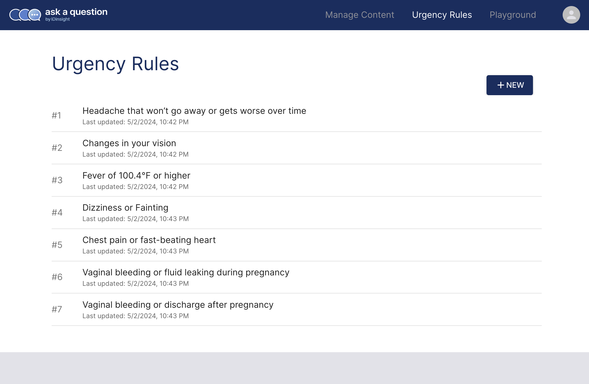

---
authors:
  - Sid
category:
  - Admin App
  - Urgency Detection
date: 2024-05-02
---
# Introducing Urgency Detection

You may wish to handle urgent messages differently. For example, when deploying
a question answering service in a health context, you may wish to refer the user to their
nearest health center, or escalate it immediately to a human operator.

We introduce a new endpoint and new page in the Admin App to enable this.

<!-- more -->

## Defining urgency rules

Using the Admin App, you can define your rules in natural language. For example,
here are a few rules borrowed directly from the CDC website on
[Urgent Maternal Warning Signs](https://www.cdc.gov/hearher/maternal-warning-signs/index.html):

{: .blog-img }

It's as simple as that. You don't need to train a model (though you can if you want to.
See ["Or write your own"](#or-write-your-own) below).

## Using the urgency detection endpoint

You should refer to your Swagger UI/OpenAPI documentation for details but here is
a screenshot for us lazy ones:

{: .blog-img }


## Pick your method

As of this blog post, there are two ways to determine urgency:

1. **Cosine Distance** - It uses the cosine distance between the
   input and the urgency rules to determine urgency. It's simple and fast, but may not be
   as accurate as the next method.
2. **LLM Entailment** - This calls an LLM to determine if the message matches the
   urgency rules. It's more accurate, but slower. Also, since it's making a call to the LLM, it
   is more expensive than the cosine distance method.

See [setup](../../components/urgency-detection/index.md) sections on how to configure these.

## Or write your own

May be you are not happy with either of these and want to try out that new entailment
model. All you need to do is define your function with this signature:

```python

@urgency_classifier
async def your_fancy_method(
    asession: AsyncSession,
    urgency_query: UrgencyQuery,
) -> UrgencyResponse:
```

and you can update the `URGENCY_CLASSIFIER` environment variable to `your_fancy_method`.

### Using a different model

Reminder that we [setup a proxy server](./move-to-litellm-proxy.md) to make it
easy to switch between models. If you want to use a different model, you can host it
and update the `LITELLM_MODEL_URGENCY_DETECT` environment variable to point to your model.

## Doc references

- [LLM Proxy Server](../../components/litellm-proxy/index.md)
- [Urgency Detection](../../components/urgency-detection/index.md)
- [Managing Urgency Rules](../../components/admin-app/manage-urgency-rules.md)
